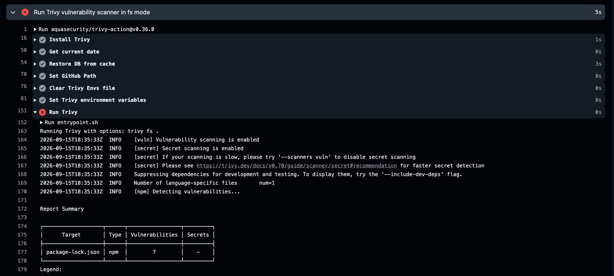
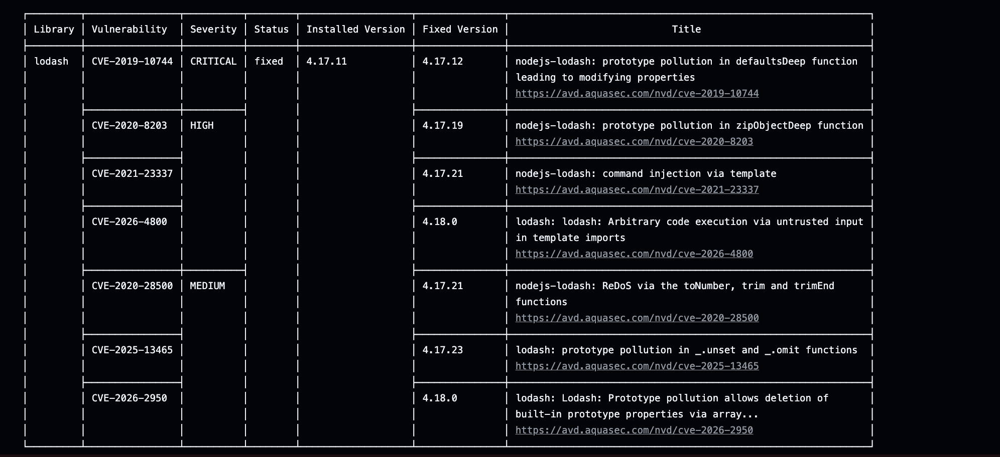

# DevSecOps Take-Home Exam — Documentation

This is the starter repository for the **LSCS DevSecOps Engineering Take-Home Exam**.

## Setup & Running Instructions

### Prerequisites
* [Docker](https://docs.docker.com/get-docker/) installed and running locally
* [Node.js](https://nodejs.org/) (v24 LTS recommended)

### Clone the Repository
```bash
git clone https://github.com/JehannAbar/devsecops-exam-starter.git
cd devsecops-exam-starter
```

### 1. Local Development
Install dependencies:
```bash
npm install
```

Start the application:
```bash
npm start
```

Run unit tests:
```bash
npm test
```

You can check if the application runs on `http://localhost:3000`. You can verify it via `http://localhost:3000/health`.

### 2. Running with Docker

Build the latest Docker image:
```bash
docker build --pull -t macky-merch-api .
```

Run the container:
```bash
docker run -p 3000:3000 macky-merch-api
```

Verify application health by making a request to the health endpoint:
```bash
curl http://localhost:3000/health
```

## Architectural Explanation

### Base Image Choice (`node:24-alpine`)
It was selected to ensure stability, long-term support per NodeJS' site. Alpine was also chosen because it is popularly known as a reliable lightweight Linux distribution, which lowers the base image size.

### Multi-Stage Build & Optimization
To reduce the image size even further, a multi-stage build was performed. A multi-stage build works best with executable binaries, and although JavaScript is an interpreted language, it could still reduce the size through devDependencies.

* **Stage 1**: Builds the necessarry dependencies and eliminates devDependencies.
* **Stage 2**: Copies only runtime artifacts (`server.js` and production `node_modules`) onto a fresh base image.

### Security Decisions
* Trivy was the chosen vulnerability scanner for its versatility. It could be used to scan for container images, git repositories, and, local source code files, configurations, and many more.
* The user is also non-root for security reasons. Someone could escape that container environment, known as a [container escape](https://www.wiz.io/academy/container-security/container-escape), by having root permissions on that container.

### Branch Rule Protection
Enforces a rule to prevent merging pull requests whenever Github Actions fails by enabling status checks to pass.


## Vulnerability Demonstration

To test the security scanning controls inside the GitHub Actions CI pipeline, an intentionally vulnerable package was introduced:

* Use `lodash` with a version `4.17.11` inside `package.json`.
* It identified several vulnerabilities such as **CVE-2019-10744**, **CVE-2020-8203**, **CVE-2021-23337**  and many more.

The images below are proof:




## Challenges Faced

I went into this challenge with very little knowledge on Docker, Github Actions, and the CI/CD pipeline in general. Initially the syntax was overwhelming since there were a lot of background concepts I needed to learn such as Github Events, containers, images and others. Especially Docker containers because they require a lot of background knowledge. 

I was also initially confused on why multi-staging docker would help reduce the size because a lot of the ways people use it is by copying the compiled binary in the second step. This is different from interpreted languages which do not produce any form of binary. I also faced issues in terms of syntax during the Continuous Integration process, such as not putting the correct version tags. 

However, I was able to overcome them by researching the material and its documentation, watching videos, and help from AI for conceptual understanding of the pipeline. 
